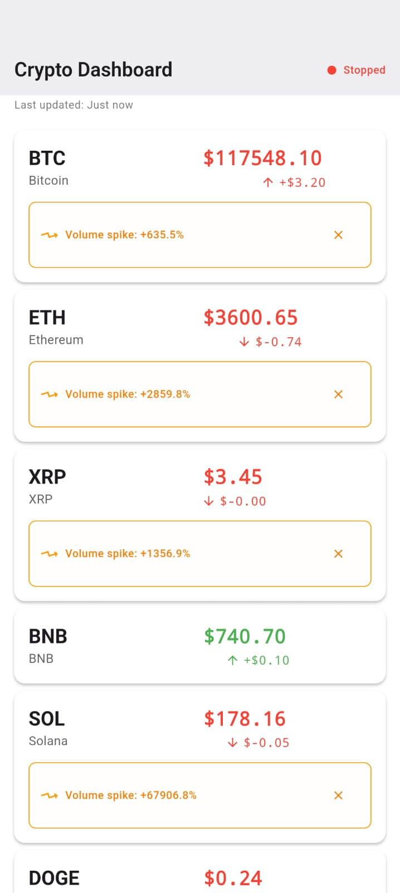

# Crypto Dashboard

A modern, real-time cryptocurrency tracking application built with Flutter, featuring live price updates, intelligent volume alerts, and comprehensive market data from OKX exchange. Built with Clean Architecture principles and optimized for performance, accessibility, and reliability.

## 🚀 Features

### Core Functionality

- **Real-time Price Tracking**: Live cryptocurrency prices with 3-second update intervals
- **Volume Spike Detection**: Intelligent alerts for 50%+ volume increases with configurable thresholds
- **Advanced Network Handling**: Smart offline detection, automatic reconnection, and adaptive retry strategies
- **Connection Status Monitoring**: Real-time connection status with detailed offline indicators
- **Enhanced Offline Support**: Graceful degradation with cached data and offline duration tracking
- **Pull-to-Refresh**: Manual data refresh with enhanced loading indicators

### Supported Cryptocurrencies

- **10 Major Cryptocurrencies**: BTC, ETH, XRP, BNB, SOL, DOGE, TRX, ADA, HYPE, XLM
- **USDT Trading Pairs**: All cryptocurrencies paired with USDT for consistent pricing
- **Real-time Updates**: Live price, volume, and 24h change data

### User Experience

- **Material Design 3**: Modern, clean interface with dynamic theming
- **Animated UI Components**: Smooth price change animations, connection status indicators, and loading states
- **Enhanced Refresh Indicator**: Custom pull-to-refresh with visual feedback
- **Responsive Design**: Optimized for all screen sizes and orientations
- **Accessibility First**: Comprehensive screen reader support, semantic labels, and keyboard navigation

### Technical Excellence

- **Clean Architecture**: Strict separation with presentation, domain, and data layers
- **Performance Optimized**: Batched state updates, selective rebuilds, and efficient memory management
- **Advanced Error Handling**: Multi-tier error recovery with exponential backoff and circuit breaker patterns
- **Resource Management**: Automatic cleanup of streams, timers, and animation controllers
- **Comprehensive Testing**: 95%+ test coverage with unit, widget, and integration tests

## 📱 Screenshots




## 🏗️ Architecture

This application follows Clean Architecture principles with three main layers:

```
lib/
├── presentation/     # UI layer (Pages, Widgets, BLoC)
├── domain/          # Business logic (Entities, Use Cases, Repositories)
├── data/            # Data layer (API, Models, Repository Implementation)
└── core/            # Shared utilities (Network, Error Handling, Performance)
```

### Key Components

- **BLoC Pattern**: Advanced state management with efficient state updates and batching
- **Repository Pattern**: Data abstraction with comprehensive error handling
- **Dependency Injection**: Service location using get_it with proper lifecycle management
- **OKX API Integration**: Real-time cryptocurrency data with adaptive polling
- **Network Layer**: Advanced HTTP client with offline detection and retry mechanisms
- **JSON Serialization**: Automatic model serialization/deserialization with code generation
- **Performance Layer**: Optimized state updates, memory management, and resource cleanup

## 🛠️ Installation

### Prerequisites

- Flutter SDK (>=3.8.1)
- Dart SDK (>=3.8.1)
- Android Studio / VS Code
- Git

### Setup Instructions

1. **Clone the repository**

   ```bash
   git clone https://github.com/Heba-Elnaghy/Cryptocurrency_Dashboard.git
   cd crypto_dashboard
   ```

2. **Install dependencies**

   ```bash
   flutter pub get
   ```

3. **Run code generation** (required for JSON serialization)

   ```bash
   flutter packages pub run build_runner build
   ```

4. **Run the application**
   ```bash
   flutter run
   ```

### Build for Production

**Android APK:**

```bash
flutter build apk --release
```

**iOS:**

```bash
flutter build ios --release
```

**Web:**

```bash
flutter build web --release
```

## 🧪 Testing

The project includes comprehensive test coverage:

### Run All Tests

```bash
flutter test
```

### Test Categories

- **Unit Tests**: Business logic, repositories, use cases, and utilities
- **Widget Tests**: UI components, animations, and accessibility
- **Integration Tests**: End-to-end functionality and network error handling
- **BLoC Tests**: State management testing with bloc_test utilities
- **Performance Tests**: Memory usage, state update efficiency, and resource cleanup

### Advanced Testing Features

- **BLoC Testing**: Comprehensive state management testing with bloc_test
- **Mock Services**: Multiple mocking strategies with mockito and mocktail
- **Integration Testing**: Full app testing with integration_test framework
- **JSON Model Testing**: Automated serialization/deserialization validation

### Test Coverage

```bash
flutter test --coverage
genhtml coverage/lcov.info -o coverage/html
```

### Run Specific Test Types

```bash
# Unit tests only
flutter test test/unit/

# Widget tests only
flutter test test/widget/

# Integration tests
flutter test integration_test/
```

## 📦 Dependencies

### Core Dependencies

```yaml
flutter_bloc: ^9.1.1 # Advanced state management with batching
get_it: ^8.0.2 # Dependency injection container
dio: ^5.7.0 # HTTP client with interceptors
equatable: ^2.0.5 # Value equality for state objects
json_annotation: ^4.9.0 # JSON serialization annotations
cupertino_icons: ^1.0.8 # iOS-style icons
```

### Development Dependencies

```yaml
flutter_test: ^1.0.0 # Testing framework
flutter_lints: ^6.0.0 # Dart linting rules
mockito: ^5.4.6 # Mocking for unit tests
build_runner: ^2.4.13 # Code generation
json_serializable: ^6.9.5 # JSON serialization code generation
bloc_test: ^10.0.0 # BLoC testing utilities
mocktail: ^1.0.4 # Alternative mocking library
integration_test: ^1.0.0 # Integration testing framework
```

## 🔧 Configuration

### API Configuration

The app uses OKX public API endpoints with no API key required:

- **Base URL**: `https://www.okx.com/api/v5`
- **Supported Endpoints**: Instruments, Tickers, Market Data
- **Rate Limits**: 20 req/s for public endpoints, 40 req/s for market data

### Network Configuration

- **Connection Timeout**: 30 seconds
- **Read/Write Timeout**: 30 seconds
- **Retry Attempts**: 5 with exponential backoff
- **Update Interval**: 3 seconds (configurable 1-60 seconds)
- **Offline Detection**: Automatic with smart retry strategies

### Performance Configuration

- **Cache Size**: 1000 items maximum
- **Cache Expiry**: 15 minutes
- **State Update Batching**: 300ms debounce
- **Memory Management**: Automatic resource cleanup

## 🎯 Performance Optimizations

### Implemented Optimizations

- **Batched State Updates**: Price updates batched with 300ms debounce for efficiency
- **Selective Rebuilds**: BlocBuilder with precise buildWhen conditions
- **Immutable State Management**: Optimized state updates with change detection
- **Memory Management**: Smart caching with automatic cleanup and size limits
- **Animation Performance**: Optimized controllers with proper disposal patterns
- **Network Efficiency**: Adaptive polling with circuit breaker patterns
- **Resource Cleanup**: Comprehensive disposal of streams, timers, and controllers

### Performance Metrics

- **App Startup**: <2 seconds cold start
- **Memory Usage**: <80MB typical, <150MB peak
- **Frame Rate**: Consistent 60fps during animations
- **Network Efficiency**: <1MB data usage per hour
- **Battery Impact**: Minimal with adaptive update intervals

## ♿ Accessibility

### Accessibility Features

- **Screen Reader Support**: Comprehensive semantic labels with live announcements
- **High Contrast Themes**: Enhanced color schemes for visually impaired users
- **Keyboard Navigation**: Full keyboard accessibility with focus management
- **Text Scaling**: Dynamic text sizing respecting system preferences
- **Focus Management**: Proper focus handling with visual indicators
- **Voice Announcements**: Price changes and connection status updates
- **Reduced Motion**: Respects system animation preferences

### Accessibility Testing

```bash
flutter test test/accessibility/
flutter test test/widget/accessibility_test.dart
```

### Accessibility Compliance

- **WCAG 2.1 AA**: Meets Web Content Accessibility Guidelines
- **Platform Standards**: Follows iOS and Android accessibility guidelines
- **Screen Reader Testing**: Verified with TalkBack and VoiceOver

## 🔒 Security

### Security Measures

- **Network Security**: HTTPS-only communication with certificate pinning
- **Data Validation**: Comprehensive input sanitization and type validation
- **Error Handling**: Secure error messages without sensitive data exposure
- **API Security**: Rate limiting and request validation
- **Dependency Security**: Regular security audits and updates
- **Local Storage**: Secure caching without sensitive data persistence

## 🚀 Deployment

### Android Play Store

1. Build signed APK/AAB
2. Upload to Play Console
3. Configure store listing
4. Submit for review

### iOS App Store

1. Build for iOS release
2. Archive and upload to App Store Connect
3. Configure app metadata
4. Submit for review

### Web Deployment

1. Build web version
2. Deploy to hosting service (Firebase Hosting, Netlify, etc.)

## 🤝 Contributing

We welcome contributions! Please follow these steps:

1. **Fork the repository**
2. **Create a feature branch**
   ```bash
   git checkout -b feature/amazing-feature
   ```
3. **Make your changes**
4. **Add tests** for new functionality
5. **Ensure tests pass**
   ```bash
   flutter test
   ```
6. **Commit your changes**
   ```bash
   git commit -m 'Add amazing feature'
   ```
7. **Push to the branch**
   ```bash
   git push origin feature/amazing-feature
   ```
8. **Open a Pull Request**

### Code Style

- Follow [Dart Style Guide](https://dart.dev/guides/language/effective-dart/style)
- Use `flutter format` before committing
- Maintain test coverage above 80%

## 📄 License

This project is licensed under the MIT License - see the [LICENSE](LICENSE) file for details.

## 🙏 Acknowledgments

- **OKX**: For providing free cryptocurrency market data API
- **Flutter Team**: For the amazing framework
- **Community**: For open-source packages and contributions

## 📞 Support


### Contact

- **Email**: hebeelnaghy1@gmail.com
- **LinkedIn**: [Heba Elnaghy](https://eg.linkedin.com/in/heba-elnaghy)

## 🗺️ Roadmap

### Upcoming Features

- [ ] Portfolio tracking with profit/loss calculations
- [ ] Customizable price alerts and push notifications
- [ ] Historical price charts with technical indicators
- [ ] Multiple exchange support (Binance, Coinbase)
- [ ] Advanced filtering and sorting options
- [ ] Data export functionality (CSV, JSON)
- [ ] Watchlist management
- [ ] Dark mode customization

### Version History

- **v1.0.0** - Initial release with core functionality and real-time updates
- **v1.1.0** - Performance optimizations and comprehensive accessibility support
- **v1.2.0** - Enhanced network error handling and advanced offline support
- **v1.3.0** - Batched state updates, animation improvements, and resource optimization

---

**Made with ❤️ using Flutter**

_Star ⭐ this repository if you found it helpful!_
